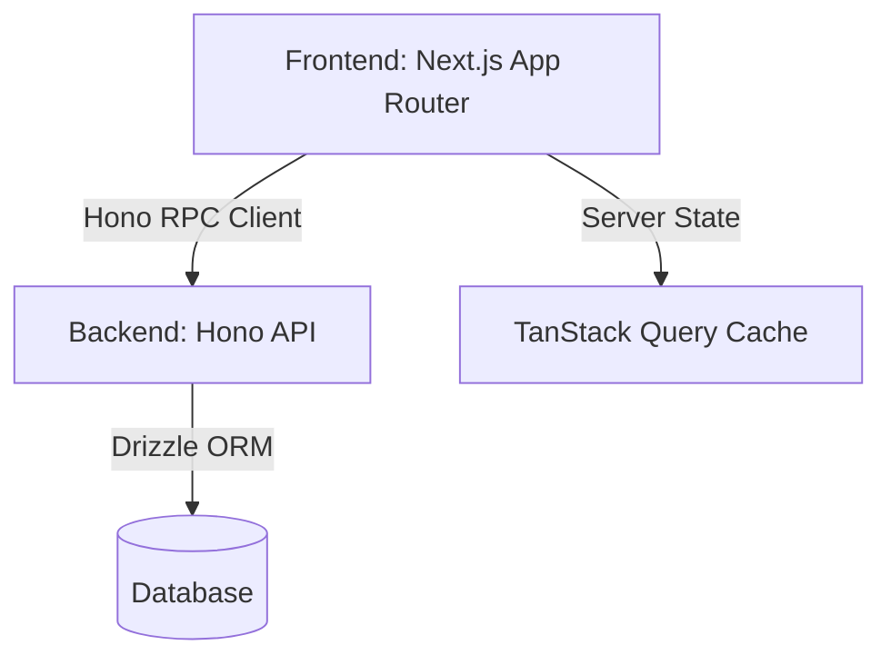
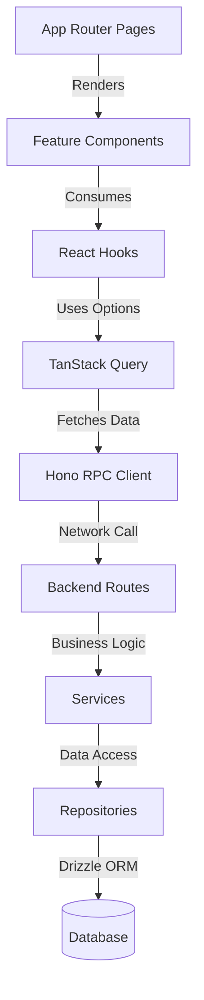

# LambadaOps Architecture Guide

This document is the official architecture guide and engineering specification for the LambadaOps project. It defines the mandatory engineering standards for every module. Every future feature MUST follow this guide.

## 1. Project Overview
LambadaOps is a multi-tenant IT Asset Lifecycle Management SaaS. 

- **Monorepo Structure**: The project is structured as a Turborepo monorepo containing `apps/api` (Backend) and `apps/web` (Frontend), along with shared packages.
- **Backend**: Built with Hono and deployed on Cloudflare Workers, using Drizzle ORM for database interactions.
- **Frontend**: Built with Next.js App Router (React 19), styled with Tailwind CSS and shadcn/ui.
- **Shared Types**: End-to-end type safety is maintained using Hono RPC, allowing the frontend to infer types directly from the backend routes.
- **State Management**: TanStack Query (React Query) v5 is the sole owner of server state.

### Architecture Diagram


## 2. Folder Structure
The frontend strictly follows a feature-first folder structure. Every feature module (e.g., assets, tickets, maintenance) must reside in `src/features/<feature>/` and adhere to the following layout:

```text
src/features/<feature>/
├── api/
│   ├── client.ts       # Hono RPC client instance for the feature
│   ├── query-keys.ts   # Query key factory
│   ├── queries.ts      # queryOptions definitions
│   └── mutations.ts    # mutation definitions and invalidation logic
├── components/         # Feature-specific React components
├── hooks/              # Feature-specific custom React hooks
├── schemas/            # Zod validation schemas
├── types/              # Feature-specific TypeScript types
├── lib/                # Feature-specific business logic or utilities
└── utils/              # Helper functions
```
- **api/**: Encapsulates all data fetching and server state mutation.
- **components/**: Contains all UI components specific to the feature.
- **schemas/**: Contains the single source of truth for data validation.

## 3. API Layer
The `api/` directory strictly separates responsibilities to ensure clean data access.

- **`client.ts`**: Dedicated to Hono RPC setup. No React, no hooks, no UI logic.
- **`queries.ts`**: Exports TanStack Query `queryOptions()` factories. Never inline `useQuery` configurations inside components.
- **`mutations.ts`**: Exports custom hooks wrapping `useMutation` with built-in cache invalidation logic.
- **`query-keys.ts`**: Contains the query key factory for the feature. Never hardcode strings in components.

## 4. Query Key Convention
Every feature must define its query keys in a single factory object.

**Example (`features/assets/api/query-keys.ts`):**
```typescript
export const assetKeys = {
  all: ['assets'] as const,
  lists: () => [...assetKeys.all, 'list'] as const,
  list: (filters: Record<string, any>) => [...assetKeys.lists(), filters] as const,
  details: () => [...assetKeys.all, 'detail'] as const,
  detail: (id: number) => [...assetKeys.details(), id] as const,
};
```
Cache invalidation in mutations must reference these keys (e.g., `queryClient.invalidateQueries({ queryKey: assetKeys.lists() })`).

## 5. TanStack Query Rules
TanStack Query is the ONLY source of server state.

- **NO fetch inside components**: Components must never call `fetch()` or Hono RPC directly.
- **NO useEffect fetching**: Never use `useEffect` to fetch data or manage loading states.
- **Consume Options**: Components must consume `queryOptions` exported from `queries.ts`.
- **Cache Invalidation**: Mutations must invalidate relevant query keys on success.
- **StaleTime/GcTime**: Configure sensible defaults globally or per-query (e.g., 5 minutes staleTime for reference data).

## 6. Forms
All forms must be built using **React Hook Form** combined with **Zod** for validation.

- **Strong Typing**: Use `z.infer<typeof schema>` to type form values. NEVER use `useForm<any>`.
- **Validation**: Validation logic lives ONLY in `schemas/`.
- **Create/Edit Strategy**: Reuse the same component (e.g., `AssetForm`) for both creation and editing, conditionally passing an `assetId` or `initialData` to switch schemas and submission mutations.

## 7. Authentication
The backend user profile is the absolute source of truth.

**Authentication Flow:**
1. User logs in.
2. Backend issues a JWT.
3. Frontend stores the JWT in `localStorage`.
4. App initialization calls `GET /api/auth/me` via TanStack Query.
5. The `AuthContext` consumes the fetched profile.
6. UI and RoleGuards rely entirely on the `AuthContext` profile, never the decoded JWT claims.

*Rationale*: JWTs can become stale if roles or permissions change. Fetching `/api/auth/me` ensures the frontend always has the most current state of the user profile.

## 8. Navigation
All routing must use Next.js App Router mechanisms to preserve application state (SPA navigation).

- **Use**: `useRouter().push()`, `useRouter().replace()`, or `<Link>`.
- **Forbid**: `window.location.href` is explicitly forbidden unless a full page reload is strictly necessary (e.g., logging out and clearing all memory/React context).

## 9. Component Guidelines
UI components must remain deterministic and focused on presentation.

- **NEVER** fetch data directly.
- **NEVER** decode JWTs.
- **NEVER** construct API URLs manually.
- **NEVER** call the backend directly.
- **MUST** receive strongly typed props and remain as reusable as possible.

## 10. Backend API Guidelines
The backend serves as a multi-tenant API using Hono.

- **Hono RPC**: Endpoints must be strictly typed and chained (`new Hono().use().route().get(...)`) to preserve type inference for the frontend client.
- **Reference Endpoints**: Master data (e.g., categories, locations, departments) are grouped under `/api/reference`. This separates core operational logic from slowly changing lookup data.
- **Multi-tenant Rules**: Every single database query must filter by `tenantId`.
- **REST Naming**: Use standard RESTful resource naming (e.g., `/api/assets`, `/api/assets/:id`).

## 11. Type Safety
The project adheres to a strict zero-tolerance policy for type escapes.

- **NO** `any`
- **NO** `@ts-ignore`
- **NO** `@ts-expect-error`
- **USE** `z.infer` for deriving types from schemas.
- **USE** Hono's inferred types for API responses (e.g., `Awaited<ReturnType<typeof getAssets>>[number]`).

## 12. Naming Convention
Consistency in naming is mandatory.

- **Features**: lowercase, pluralized where appropriate (`assets`, `tickets`).
- **Queries**: `[feature]Queries.list()`, `[feature]Queries.detail(id)`.
- **Mutations**: `useCreate[Feature]`, `useUpdate[Feature]`.
- **Hooks**: `use[Action]`.
- **Components**: PascalCase (e.g., `AssetTable`, `AssetStatusBadge`).
- **Schemas**: `create[Feature]Schema`, `update[Feature]Schema`.
- **Types**: PascalCase (e.g., `Asset`, `AssetFormValues`).
- **Files**: kebab-case (e.g., `asset-table.tsx`, `query-keys.ts`).

## 13. Code Review Checklist
Every Pull Request must be verified against the following:
- [ ] No inline fetch
- [ ] No duplicated schema
- [ ] No duplicated query key
- [ ] No `any`
- [ ] No `@ts-ignore` / `@ts-expect-error`
- [ ] No duplicated business logic
- [ ] No `window.location.href` (except unauth redirects)
- [ ] Zero lint warnings
- [ ] Zero TypeScript errors
- [ ] Correct cache invalidation in mutations
- [ ] Proper loading state handling
- [ ] Proper empty state handling
- [ ] Proper error state handling

## 14. Module Development Checklist
Every future module (Assignment, Maintenance, Ticket, Notification, Billing) must be developed in the following sequence:

1. **API** -> 2. **Queries** -> 3. **Mutations** -> 4. **Components** -> 5. **Pages** -> 6. **Verification**

## 15. Architectural Decisions (ADR)
Important decisions already established:

- **Backend owns authentication**: Prevents client-side spoofing.
- **Backend profile is source of truth**: JWTs are merely transport tokens; the DB is the source of truth for authorization.
- **TanStack Query owns server state**: Eliminates race conditions, manual loading states, and duplicate fetches.
- **Feature-first architecture**: Colocates related code, making the codebase scale without massive cognitive overhead.
- **Asset module is the reference implementation**: Established as the gold standard for all future CRUD modules.
- **Hono RPC for end-to-end type safety**: Eradicates the need for duplicating TypeScript interfaces across the network boundary.
- **Reference endpoints grouped under /api/reference**: Centralizes master data fetching for drop-downs.
- **Zero-warning & Zero-any policy**: Ensures technical debt does not accumulate.

## 16. Dependency Rules
To maintain a strict separation of concerns, the following dependency direction is mandatory:

```text
UI (Pages)
  ↓
Feature Components
  ↓
Hooks
  ↓
Queries / Mutations
  ↓
API Client (Hono RPC)
  ↓
Backend Routes
  ↓
Services
  ↓
Repositories
  ↓
Database
```

### Explicitly Prohibited
Reverse dependencies or skipping layers are strictly prohibited.
- **Component → fetch()**: Components must never execute HTTP calls natively.
- **Component → client.ts**: Components must never call the RPC client directly.
- **Component → Database**: Frontend code must never import database libraries.
- **Client → React**: The `api/client.ts` must remain pure TypeScript. No React hooks.
- **Queries → UI**: Query factories must not contain UI code, toast notifications, or navigations.
- **Mutations → Components**: Mutations must not import or render React components.

## 17. Module Dependency Graph
The end-to-end architecture follows a unified pipeline. The graph below dictates how features consume data.


*Rationale for prohibited reverse dependencies*: If a component calls the RPC client directly, it bypasses the TanStack Query cache, leading to duplicate network requests and stale UI state. If query factories contain UI code (like toasts), they become impossible to use in background workers or server contexts. Strict layer isolation guarantees predictability and horizontal scaling of feature teams.
